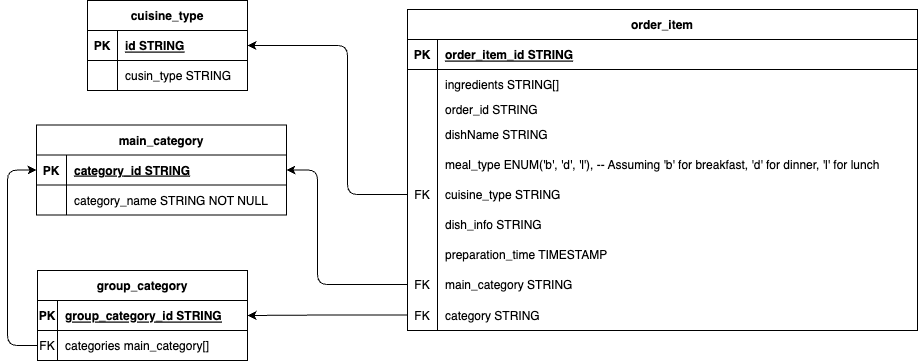

# Strategy for Classifying and Scaling Meals
Guy..Lister
For ZenFeat -- May 22, 2024


---

# Strategy for Classifying and Scaling Meals
1.  Data Cleaning and Preprocessing
2.  Category Definition
3.  Database Structuring
4.  Indexing for Scalability
5.  Menu Generation
6.  Open Source Tools and Libraries

---
## 1. Data Cleaning and Preprocessing
   - Extract unique meal names from the `order_item` table, ensuring that variants (e.g., "chicken burger", "vegan burger") are normalized to a common base meal name ("burger").
   - Remove duplicates and standardize meal names to avoid any inconsistencies.
  
---

<style scoped>
.columns {
  font-size: 20px;
  display: grid;
  grid-template-columns: repeat(3, minmax(0, 1fr));
  gap: 1rem;
  max-width: 60%;
  margin: 0rem auto;
}
</style>

## 2. Category Definition
   - Define a limited set of high-level meal categories. Based on the provided second attachment, here are potential categories:

<div class='columns'>
<div>

Additive
Bakery
Beverage
Cereal
Condiment
Dairy
Dish

</div>
<div>

Essential Oil
Fish
Flower
Fruit
Fungi
Herb
Legume
Maize

</div>
<div>

Meat
Nuts and Seeds
Plant
Plant Derivative
Seafood
Spice
Vegetable

</div>
</div>

   - Map each meal to one of these categories based on its primary characteristics.

---

## 3. Database Structuring
   - Use the existing model as a basis, ensuring the `order_item` table is linked correctly to the `main_category` and `group_category` tables.
   - Create additional tables or fields if necessary to better capture the relationship between meals and their categories.

---

## 4. Indexing for Scalability
   - Implement database indexing on key fields such as `dishName`, `meal_type`, `main_category`, and `group_category` to improve query performance.
   - Consider using composite indexes where appropriate to optimize searches involving multiple criteria.

---

## 5. Menu Generation
   - Develop a query or a series of queries to generate menus based on the categorized meal data.
   - Ensure the queries are optimized for performance, especially if the dataset is large.

---

## 6. Open Source Tools and Libraries
   - Use open-source libraries such as `pandas` for data manipulation and `SQLAlchemy` for database operations in Python.
   - Consider using Elasticsearch for advanced search capabilities if needed.

---
<style scoped>
ul li {
   line-height: 1; /* Adjust this value to reduce line spacing */
}
</style>
# Implementation Steps
**a. Extract and Clean Data**
   - Write a script to extract unique meal names from the `order_item` table.
   - Normalize the meal names to remove variants.
  
**b. Define Categories**
   - Create a mapping of meal names to high-level categories.

**c. Database Schema Update**
   - Update the database schema if necessary to ensure proper indexing and relationships.

**d. Menu Generation Query**
   - Develop and test the query to generate the menu.

---
## Sample Python script outline for data extraction and normalization
```python
import pandas as pd

# Load data from the database (example using pandas and SQLAlchemy)
from sqlalchemy import create_engine

engine = create_engine('sqlite:///your_database.db')
order_items = pd.read_sql_table('order_item', engine)

# Normalize meal names (example function, expand as needed)
def normalize_meal_name(meal_name):
    base_name = meal_name.split()[0]  # Simplistic approach, improve as needed
    return base_name

order_items['normalized_dishName'] = order_items['dishName'].apply(normalize_meal_name)

# Remove duplicates
unique_meals = order_items['normalized_dishName'].unique()

# Define categories (example mapping, expand as needed)
categories = {
    'burger': 'Dish',
    'pizza': 'Dish',
    'salad': 'Dish',
    # Add more mappings
}

# Map meals to categories
order_items['category'] = order_items['normalized_dishName'].map(categories)

# Save back to the database or use for further processing
order_items.to_sql('order_item', engine, if_exists='replace', index=False)
```
---
## Generic DDL for scaling meals
```sql
CREATE TABLE main_category (
    category_id STRING PRIMARY KEY,
    category_name STRING NOT NULL
);

CREATE TABLE group_category (
    group_category_id STRING PRIMARY KEY,
    categories main_category[]
);

CREATE TABLE cuisine_type (
    id STRING PRIMARY KEY,
    cusin_type STRING
);

CREATE TABLE order_item (
    order_item_id STRING PRIMARY KEY,
    ingredients STRING[],
    order_id STRING,
    dishName STRING,
    meal_type ENUM('b', 'd', 'l'),  -- Assuming 'b' for breakfast, 'd' for dinner, 'l' for lunch
    cuisine_type STRING,
    dish_info STRING,
    preparation_time TIMESTAMP,
    main_category STRING,
    category STRING,
    FOREIGN KEY (cuisine_type) REFERENCES cuisine_type(id),
    FOREIGN KEY (main_category) REFERENCES main_category(category_id),
    FOREIGN KEY (category) REFERENCES group_category(group_category_id)
);
```
---

# Visualization of Schema



---

<style scoped>
.columns {
   display: grid;
   grid-template-columns: repeat(2, 1fr);
   gap: 1rem;
}
</style>
# SqlAlchemy setup, meals.py
<div class="columns">

```python
from sqlalchemy import create_engine, Column, String, Enum, ForeignKey, Table, ARRAY, TIMESTAMP
from sqlalchemy.ext.declarative import declarative_base
from sqlalchemy.orm import relationship, sessionmaker

Base = declarative_base()

class MainCategory(Base):
    __tablename__ = 'main_category'
    
    category_id = Column(String, primary_key=True)
    category_name = Column(String, nullable=False)
    
class GroupCategory(Base):
    __tablename__ = 'group_category'
    
    group_category_id = Column(String, primary_key=True)
    categories = Column(ARRAY(String))
    
class CuisineType(Base):
    __tablename__ = 'cuisine_type'
    
    id = Column(String, primary_key=True)
    cusin_type = Column(String)
    
class OrderItem(Base):
    __tablename__ = 'order_item'
    
    order_item_id = Column(String, primary_key=True)
    ingredients = Column(ARRAY(String))
    order_id = Column(String)
    dishName = Column(String)
    # 'b' for breakfast, 'd' for dinner, 'l' for lunch
    meal_type = Column(Enum('b', 'd', 'l', name='meal_type'))  
    cuisine_type = Column(String, ForeignKey('cuisine_type.id'))
    dish_info = Column(String)
    preparation_time = Column(TIMESTAMP)
    main_category = Column(String, ForeignKey('main_category.category_id'))
    category = Column(String, ForeignKey('group_category.group_category_id'))

    cuisine_type_rel = relationship('CuisineType', backref='order_items')
    main_category_rel = relationship('MainCategory', backref='order_items')
    group_category_rel = relationship('GroupCategory', backref='order_items')
...
```

```python
...
# Database connection
engine = create_engine('sqlite:///your_database.db')

# Create tables
Base.metadata.create_all(engine)

# Creating a session
Session = sessionmaker(bind=engine)
session = Session()

# Add some initial data if needed
main_category = MainCategory(category_id='1', category_name='Dish')
session.add(main_category)

group_category = GroupCategory(group_category_id='1', categories=['1'])
session.add(group_category)

cuisine_type = CuisineType(id='1', cusin_type='Italian')
session.add(cuisine_type)

order_item = OrderItem(
    order_item_id='1',
    ingredients=['Tomato', 'Cheese'],
    order_id='1',
    dishName='Pizza',
    meal_type='d',
    cuisine_type='1',
    dish_info='Classic Italian pizza with tomato and cheese',
    preparation_time='2023-05-10 12:00:00',
    main_category='1',
    category='1'
)
session.add(order_item)

# Commit the session
session.commit()
```

---
<!-- backgroundColor: #e6f7ff -->

### Further Explanation on Data Cleaning, Preprocessing, and Indexing for Scalability

Given your clarification, it is essential to automate as much of the process as possible to ensure scalability and efficiency as new data points are introduced. Here's a detailed plan for automating data cleaning, preprocessing, and indexing

---
<style scoped>
ul {
  line-height: 0.9em; /* Adjust this value to reduce the space */
}
ul li ul li {
  font-size: 0.8em; /* Adjust this value to change the font size */
}
</style>
### 1. Data Cleaning and Preprocessing

- **Initial Ingestion Pipeline**
  - Implement an automated data ingestion pipeline that processes new data points as they arrive. This pipeline can be built using ETL (Extract, Transform, Load) tools or custom scripts.

- **Normalization**
  - Use Natural Language Processing (NLP) techniques to normalize meal names. This can be done using libraries like `nltk`, `spaCy`, or `TextBlob`.
  - Create a normalization function that maps variant meal names to a standard base name using predefined rules or machine learning models.

- **Duplicate Detection**
  - Implement automated checks to identify and merge duplicates based on similarity measures (e.g., Levenshtein distance) or predefined rules.
  - Use clustering algorithms to group similar meal names and select a representative name for each group.

---

- **Example Script for Data Cleaning:**

```python
import pandas as pd
from fuzzywuzzy import fuzz, process
import spacy

nlp = spacy.load("en_core_web_sm")

# Example normalization function
def normalize_meal_name(meal_name):
    doc = nlp(meal_name.lower())
    # Apply custom rules to map variants to a base name
    if "burger" in meal_name:
        return "burger"
    if "pizza" in meal_name:
        return "pizza"
    return meal_name

# Function to detect duplicates
def detect_duplicates(meal_names):
    unique_names = []
    for name in meal_names:
        match, score = process.extractOne(name, unique_names, scorer=fuzz.token_set_ratio)
        if score < 90:  # threshold for similarity
            unique_names.append(name)
    return unique_names

# Load data
order_items = pd.read_csv('order_items.csv')
order_items['normalized_dishName'] = order_items['dishName'].apply(normalize_meal_name)
unique_meals = detect_duplicates(order_items['normalized_dishName'])
```

---
<style scoped>
ul {
  line-height: 0.9em; /* Adjust this value to reduce the space */
}
ul li ul li {
  font-size: 0.8em; /* Adjust this value to change the font size */
}
</style>
### 2. Indexing for Scalability

- **Database Indexing**
  - Use database management tools to automatically create and manage indexes on critical fields such as `dishName`, `meal_type`, `main_category`, and `group_category`.
  - Schedule regular maintenance tasks to update and optimize indexes as new data is added.

- **Full-Text Search**
  - Implement full-text search capabilities using tools like Elasticsearch to handle complex queries and improve search performance.
  - Set up automated indexing of new data points in Elasticsearch to ensure real-time search capabilities.

---

- **Example for Creating Indexes:**

```python
from sqlalchemy import create_engine, Index

engine = create_engine('sqlite:///your_database.db')

# Example function to create indexes
def create_indexes(engine):
    with engine.connect() as connection:
        connection.execute("CREATE INDEX idx_dishName ON order_item (dishName);")
        connection.execute("CREATE INDEX idx_meal_type ON order_item (meal_type);")
        connection.execute("CREATE INDEX idx_main_category ON order_item (main_category);")
        connection.execute("CREATE INDEX idx_group_category ON order_item (category);")

create_indexes(engine)
```
---

### Automation Framework

**Data Pipeline**
- Use tools like Apache NiFi, Airflow, or custom ETL scripts to build an automated data pipeline that handles data ingestion, cleaning, preprocessing, and indexing.

**Monitoring and Maintenance**
- Implement monitoring tools to track the performance and health of the data pipeline. Use alerts and automated maintenance scripts to address issues promptly.

**Reverse Marketplace Implementation**
- Leverage the cleaned and indexed data to drive demand by implementing recommendation systems, personalized offers, and predictive analytics.

---
### Conclusion

Automating the data cleaning, preprocessing, and indexing steps ensures scalability and efficiency as new data points are introduced. While manual intervention may be necessary for initial setup and occasional maintenance, the bulk of the process should be automated to handle the continuous influx of data effectively. This approach aligns well with the goal of developing a "reverse marketplace" by allowing data points to drive demand dynamically.

---
<!-- backgroundColor: #fff -->

## Author/Applicant

<i class="fa-brands fa-twitter"></i> Twitter:&emsp;&emsp;<a href="https://twitter.com/Guy__Lister" target="_blank">@Guy__Lister</a>
<i class="fa-brands fa-linkedin"></i> LinkedIn:&ensp;&emsp;<a href="https://www.linkedin.com/in/guy-lister-coding-consultant/" target="_blank">guy-lister-coding-consultant</a> 
<i class="fa-brands fa-github"></i> GitHub:&emsp;&emsp;<a href="https://github.com/guy--l" target="_blank">Guy--L</a>
